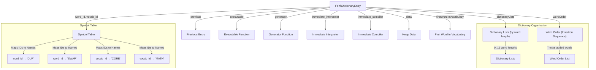

## Dictionary


```mermaid
graph TD;
    A[ForthDictionaryEntry] -->|previous| B[Previous Entry]
    A -->|word_id, vocab_id| C[Symbol Table]
    A -->|executable| D[Executable Function]
    A -->|generator| E[Generator Function]
    A -->|immediate_interpreter| F[Immediate Interpreter]
    A -->|immediate_compiler| G[Immediate Compiler]
    A -->|data| H["Heap Data"]
    A -->|firstWordInVocabulary| I["First Word in Vocabulary"]
    A -->|dictionaryLists| J["Dictionary Lists (by word length)"]
    A -->|wordOrder| K["Word Order (Insertion Sequence)"]
    
    subgraph Dictionary Organization
        J -->|0..16 word lengths| L["Dictionary Lists"]
        K -->|Tracks added words| M["Word Order List"]
    end

    subgraph Symbol Table
        C -->|Maps IDs to Names| N["word_id → 'DUP'"]
        C -->|Maps IDs to Names| O["word_id → 'SWAP'"]
        C -->|Maps IDs to Names| P["vocab_id → 'CORE'"]
        C -->|Maps IDs to Names| Q["vocab_id → 'MATH'"]
    end
```

```
