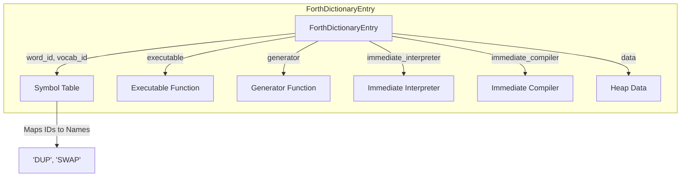

## Dictionary
 ```mermaid
graph TD;
    subgraph Dictionary Organization
        A["dictionaryLists (word length 0..16)"]
        B["wordOrder (insertion order)"]
        A -->|Links by word length| C["ForthDictionaryEntry A"]
        A -->|Links by word length| D["ForthDictionaryEntry B"]
        A -->|Links by word length| E["ForthDictionaryEntry C"]
        B -->|Tracks order| C
        B -->|Tracks order| D
        B -->|Tracks order| E
    end
    
    C -->|Previous Entry| F["ForthDictionaryEntry (Previous)"]
    D -->|Previous Entry| C
    E -->|Previous Entry| D
```

