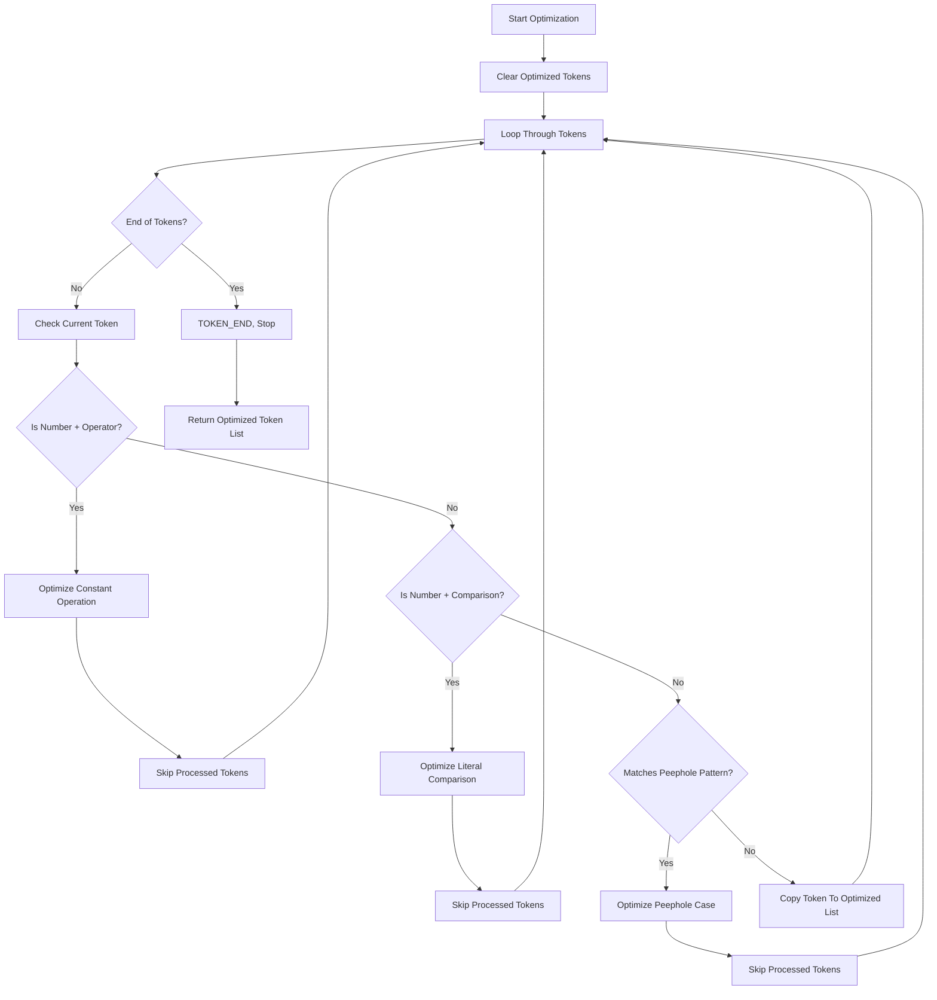

```mermaid
flowchart TD
    A[Start Optimization] --> B[Clear Optimized Tokens]
    B --> C[Loop Through Tokens]
    
    C --> D{End of Tokens?}
    D -->|Yes| E[TOKEN_END, Stop]
    D -->|No| F[Check Current Token]

    F --> G{Is Number + Operator?}
    G -->|Yes| H[Optimize Constant Operation] --> I[Skip Processed Tokens] --> C
    G -->|No| J{Is Number + Comparison?}
    
    J -->|Yes| K[Optimize Literal Comparison] --> L[Skip Processed Tokens] --> C
    J -->|No| M{Matches Peephole Pattern?}
    
    M -->|Yes| N[Optimize Peephole Case] --> O[Skip Processed Tokens] --> C
    M -->|No| P[Copy Token To Optimized List] --> C

    E --> T[Return Optimized Token List]
```
