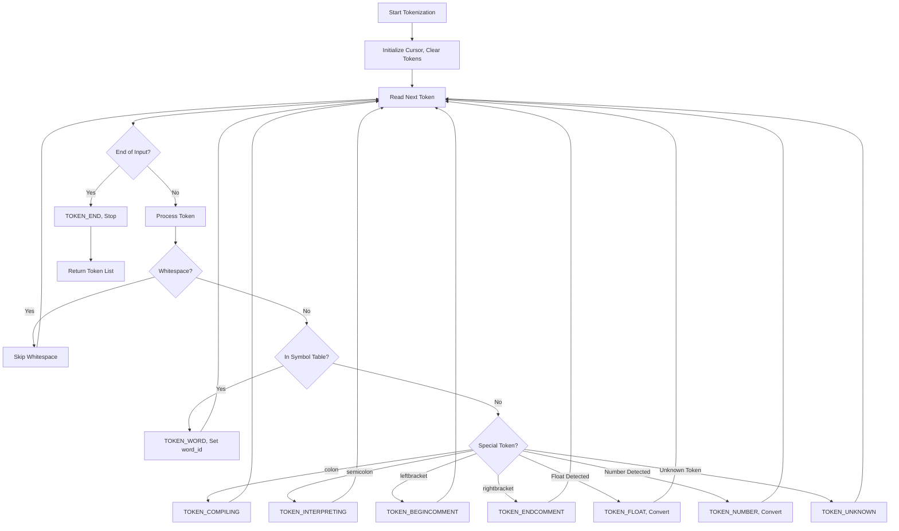

```mermaid
flowchart TD
    A[Start Tokenization] --> B[Initialize Cursor, Clear Tokens]
    B --> C[Read Next Token]
    
    C --> D{End of Input?}
    D -->|Yes| E[TOKEN_END, Stop]
    D -->|No| F[Process Token]
    
    F --> G{Whitespace?}
    G -->|Yes| H[Skip Whitespace] --> C
    G -->|No| I{In Symbol Table?}
    
    I -->|Yes| J[TOKEN_WORD, Set word_id] --> C
    I -->|No| K{Special Token?}

    K -->|colon| L[TOKEN_COMPILING] --> C
    K -->|semicolon| M[TOKEN_INTERPRETING] --> C
    K -->|leftbracket| N[TOKEN_BEGINCOMMENT] --> C
    K -->|rightbracket| O[TOKEN_ENDCOMMENT] --> C
    K -->|Float Detected| P[TOKEN_FLOAT, Convert] --> C
    K -->|Number Detected| Q[TOKEN_NUMBER, Convert] --> C
    K -->|Unknown Token| R[TOKEN_UNKNOWN] --> C

    E --> T[Return Token List]
```
